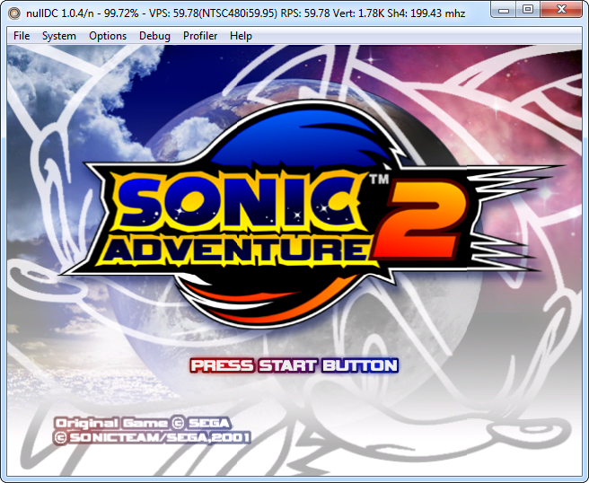

```{r setup, include=FALSE}
knitr::opts_chunk$set(echo = TRUE)
```

## What is nullDC?

NullDC is an open source Sega Dreamcast and NAOMI emulator for Windows, developed by drk||Raziel (currently under the nickname skmp) and ZeZu. It was released under the MIT license.



The emulator was first announced on February 19, 2006, with version 1.0.4 r22 being released May 9, 2010, coinciding with drk||raziel's discontinuation with the project. He also made the source code available for others to continue the project. This can be found [here ](https://github.com/skmp/nulldc).

## Requirements and Materials

NullDC requires a machine running Windows 7 or higher, DirectX 9.0c, Visual C++ runtime libraries and optionally WinPcap for modem emulation. BIOS files are also needed, and your system may need the files if you download from another source. 

It has a plugin architecture, with several alternative implementations (some ported from Chankast) for graphics, sound, reading games burned to CD-ROMs (it cannot read GD-ROMs directly) or disk image files, memory cards, etc. Please see those implementations documentation for uses, as this will be covering the standard version.

## Installation

1. Download the emulator [here](https://www.emuparadise.me/emulators/files/user/NullDC%201.0.4-389.zip) (DRAFT: As I am making this, this link is apparently no longer secure, so [here](https://dw.uptodown.com/dwn/rls3qOrZrjMknH22X5RTJGiUkLLmFWY0TX4_DiLMAz9_u_zA4D1Ufto3eUjy1G6kD-_ILuWT060LnJNd-GCP7zFmMF6CO9HJFIAa3Gd2J-mQ4G4gCS9x1lJ3s7unfSE6/XTBViCwnFGxSz1ZibyBZ_coJcVicWau8iYvsOCJiBCEqWta4i6dbLhSc-T1BxKSm2Hk7_fa5J3ROkOy3jz5Rj4tTUaYTg7sqjYdoE0YixodA8SzpBxui4YQztII9Z1Us/kk7gjLQ-SmPeOQf3upevTgmlXVEx--NSDRjJ6PjriDYsCs5aDrGmGbSv194M5zy_ft7zN70Zgcgujxt_Q1RRPg==/) is another possible link, but without the pre-installed BIOS files.)
2. Download any needed BIOS files [here](https://www.emuparadise.me/biosfiles/bios.html). (DRAFT: Wow, this is ridiculous, the site deleted all the download links apparently but kept the page.)
3. Unzip the files, keeping BIOS separate until you have extracted your nullDC folder where you specify. 
