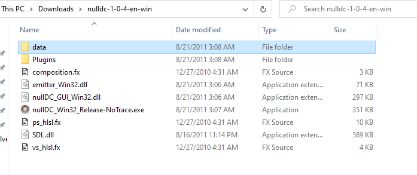
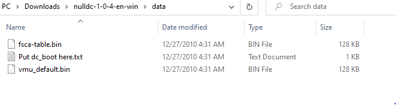
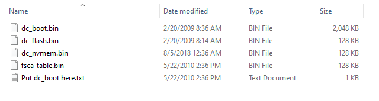
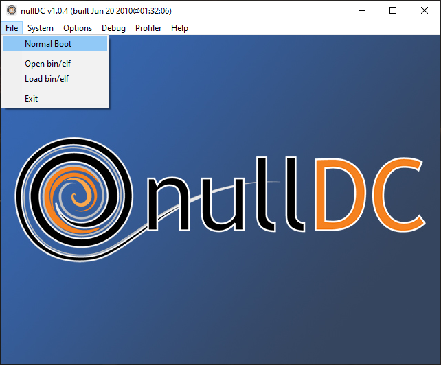
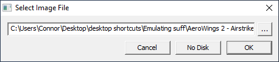
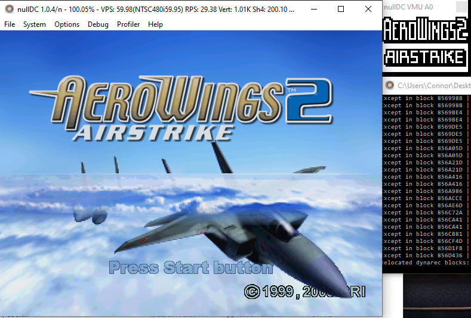
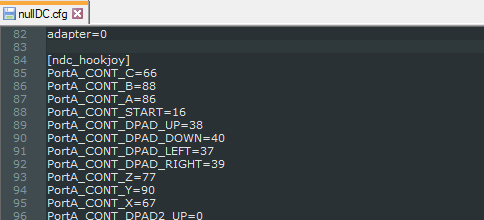

```{r setup, include=FALSE}
knitr::opts_chunk$set(echo = TRUE)
```
***
## What is nullDC?
***

NullDC is an open source Sega Dreamcast and NAOMI emulator for Windows, developed by drk||Raziel (currently under the nickname skmp) and ZeZu. It was released under the MIT license.

.PNG)

The emulator was first announced on February 19, 2006, with version 1.0.4 r22 being released May 9, 2010, coinciding with drk||raziel's discontinuation with the project.
## Requirements and Materials

NullDC requires a machine running Windows 7 or higher, DirectX 9.0c, Visual C++ runtime libraries and optionally WinPcap for modem emulation. BIOS files are also needed, and your system may need the files depending on download source. A controller that is compatible with Windows XInput system is required.

It has a plugin architecture, with several alternative implementations (some ported from Chankast) for graphics, sound, reading games burned to CD-ROMs (it cannot read GD-ROMs directly) or disk image files, memory cards, etc. Please see those implementation's documentation for uses, as this will be covering the standard version.


## Installation and Setup
***

1. Download the emulator [here](https://www.emuparadise.me/emulators/files/user/NullDC%201.0.4-389.zip) (DRAFT: As I am making this, this link is apparently no longer secure, so [here](https://dw.uptodown.com/dwn/rls3qOrZrjMknH22X5RTJGiUkLLmFWY0TX4_DiLMAz9_u_zA4D1Ufto3eUjy1G6kD-_ILuWT060LnJNd-GCP7zFmMF6CO9HJFIAa3Gd2J-mQ4G4gCS9x1lJ3s7unfSE6/XTBViCwnFGxSz1ZibyBZ_coJcVicWau8iYvsOCJiBCEqWta4i6dbLhSc-T1BxKSm2Hk7_fa5J3ROkOy3jz5Rj4tTUaYTg7sqjYdoE0YixodA8SzpBxui4YQztII9Z1Us/kk7gjLQ-SmPeOQf3upevTgmlXVEx--NSDRjJ6PjriDYsCs5aDrGmGbSv194M5zy_ft7zN70Zgcgujxt_Q1RRPg==/) is another possible link, but without the pre-installed BIOS files. I'm not sure which one you would prefer I list.)

2. Download any needed BIOS files [here](https://www.emuparadise.me/biosfiles/bios.html). 
    + The files needed are dc_boot.bin, and dc_flash.bin, and should be in the "Dreamcast boot (all regions)" folder at the webpage. (DRAFT: Wow, this is ridiculous, the site deleted all the download links apparently but kept the page. Should I link another?)

3. Unzip the nullDC folder and place it where you specify. It should looke like this:

4. Navigate to the data folder.

5. If it looks like this:
 
You will need the BIOS files.
    + Place all BIOS files inside.


6. Run **nullDC_Win32_Release-NoTrace.exe** to start the emulator. It should appear like the introductory image, with a console window as well.

7. Download the games you wish to emulate. One such site to find them is [here](https://www.emuparadise.me/Sega_Dreamcast_ISOs/1). The file types that should be downloaded are CDIs. 
    + It is recommended that you make a separate folder to store these CDIs in the same directory as the main nullDC folder, but not inside the nullDC folder itself.

8. Boot up a game. 
    + Go to the **File** tab at the top bar of the program, and Select **Normal Boot**.
    
    
    + In the new window, navigate to the CDI of the game you wish to emulate.
    
    
    + Click **OK**. The game should begin, with the VMU (Virtual Memory Unit, a screen on the original physical controller) emulation in a separate window, alongside the separate console window.
    
    

## FAQ
***

### What gamepads are usable with the emulator?
All versions of nullDC utilize the XInput gamepad framework built by Microsoft. For the most reliable results, use an Xbox brand controller.

### Is there NetPlay or Online Multiplayer?
There is no such feature implemented, and the additonal community versions past the final release 1.0.4 up to the current 1.0.6 do not have it either.

### Does it run *every* game for dreamcast?
Unfortunately with the nature of emulators, there are some games that simply don't work, or suffer graphical or other significant glitches.

### Does this work on Windows 10?
Yes. This version is still confirmed to work as of 10/27/2020. (DRAFT: I just took the screenshots, so it works for me thankfully)


## Troubleshooting
***

### "[File] is missing"
If a message saying that the emulator is missing a file, double check that DirectX 9 / C++ runtimes are installed and your windows is up to date.

Common missing files:

* d3dx9_42.dll - This is a DirectX file.
* MSVCP100.dll - This is a Windows file.
* Any file ending in Win32.dll (drkPvr_Win32.dll) followed by a "Plugin Error [number]" - This is a plugin file, it should come with the version linked, try re-installing or finding another version.

### Controller is not working
Make sure your controller is both supported with XInput, and is recognized by windows in the device pane. 

Ensure your config file has the **hookjoy** section:


Otherwise, you may need to get a separate install of a mapping program such as Joy2Key.

### Can't run [game]
Some games simply can't be run by the emulator, or will have a guaranteed crash within it. Search forums or other places to find if your game is one of them, otherwise check these possibilities:

* Ensure your CDI files are *unzipped*.
* Check that the files were completely downloaded / not corrupted.
* Some games have more than one disk, in this case have a folder with *all* of the game's CDIs, and choose the folder as the boot file.
* It might be necessary to find versions of the CDI that are within a certain region (USA, Europe should be in parenthesis next to the title).

### Immediate crashes / failure to start
Some versions are more volatile than others, with some of the later community releases being guilty of this. Depending on plugins as well, some conflicts may occur that lead to crashing.

Try a fresh install of the final official release, 1.0.4.


## Support
***

Unfortunately the project has been dropped, and is no longer officially maintained. Thankfully, it has been ten years since the end, so there is a good chance your issue has been encountered before and has been solved.

But there is still 295 official issues on their page and the last commit was eight years ago, so some people will just be out of luck.


## Licensing
***
The nullDC emulator was released under the MIT License. 


## How to Contribute
***

With the project having been discontinued, there are no further official updates or means to contribute to one.

However, as the project ended, its creators posted the source code for others to continue the project on their own. This can be found [here ](https://github.com/skmp/nulldc) at their GitHub page. 

(DRAFT NOTES: I'm working on implementing a GitHub style, but it doesn't like my .md files for some reason, so I've been using .html. Needless to say, visuals are subject to change for final draft. I also have **no idea** why the table of contents isn't showing up, I have it enabled and set to float, hopefully I can fix that for the final as well.)