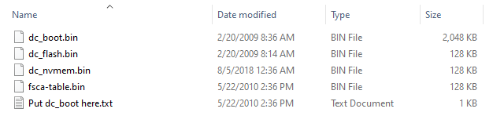

NullDC Emulator
================

## What is nullDC?

NullDC is an open source Sega Dreamcast and NAOMI emulator for Windows,
developed by drk||Raziel (currently under the nickname skmp) and ZeZu.
It was released under the MIT license.

.PNG)

The emulator was first announced on February 19, 2006, with version
1.0.4 r22 being released May 9, 2010, coinciding with drk||raziel’s
discontinuation with the project. He also made the source code available
for others to continue the project. This can be found
[here](https://github.com/skmp/nulldc).

## Requirements and Materials

NullDC requires a machine running Windows 7 or higher, DirectX 9.0c,
Visual C++ runtime libraries and optionally WinPcap for modem emulation.
BIOS files are also needed, and your system may need the files depending
on download source. A controller that is compatible with Windows XInput
system is required.

It has a plugin architecture, with several alternative implementations
(some ported from Chankast) for graphics, sound, reading games burned to
CD-ROMs (it cannot read GD-ROMs directly) or disk image files, memory
cards, etc. Please see those implementation’s documentation for uses, as
this will be covering the standard version.

## Installation and Setup

1.  Download the emulator
    [here](https://www.emuparadise.me/emulators/files/user/NullDC%201.0.4-389.zip)
    (DRAFT: As I am making this, this link is apparently no longer
    secure, so
    [here](https://dw.uptodown.com/dwn/rls3qOrZrjMknH22X5RTJGiUkLLmFWY0TX4_DiLMAz9_u_zA4D1Ufto3eUjy1G6kD-_ILuWT060LnJNd-GCP7zFmMF6CO9HJFIAa3Gd2J-mQ4G4gCS9x1lJ3s7unfSE6/XTBViCwnFGxSz1ZibyBZ_coJcVicWau8iYvsOCJiBCEqWta4i6dbLhSc-T1BxKSm2Hk7_fa5J3ROkOy3jz5Rj4tTUaYTg7sqjYdoE0YixodA8SzpBxui4YQztII9Z1Us/kk7gjLQ-SmPeOQf3upevTgmlXVEx--NSDRjJ6PjriDYsCs5aDrGmGbSv194M5zy_ft7zN70Zgcgujxt_Q1RRPg==/)
    is another possible link, but without the pre-installed BIOS files.
    I’m not sure which one you would prefer I list.)

2.  Download any needed BIOS files
    [here](https://www.emuparadise.me/biosfiles/bios.html). The files
    needed are dc\_boot.bin, and dc\_flash.bin, and should be in the
    “Dreamcast boot (all regions)” folder at the webpage. (DRAFT: Wow,
    this is ridiculous, the site deleted all the download links
    apparently but kept the page. Should I link another?)

3.  Unzip the nullDC folder and place it where you specify. It should
    looke like this: 

4.  Navigate to the data folder.

5.  If it looks like this:  You will need the BIOS
    files.
    
      - Place all BIOS files inside. 

6.  Run **nullDC\_Win32\_Release-NoTrace.exe** to start the emulator. It
    should appear like the introductory image, with a console window as
    well.

7.  Download the games you wish to emulate. One such site to find them
    is [here](https://www.emuparadise.me/Sega_Dreamcast_ISOs/1). The
    file types that should be downloaded are CDIs. It is recommended
    that you make a separate folder to store these CDIs in the same
    directory as the main nullDC folder.

8.  Boot up a game.
    
      - Go to the **File** tab at the top bar of the program, and Select
        **Normal Boot**. 
    
      - In the new window, navigate to the CDI of the game you wish to
        emulate. 
    
      - Click **OK**. The game should begin, with the VMU (Virtual
        Memoty Unit) emulation in a separate window, alongside the
        separate console window. 
